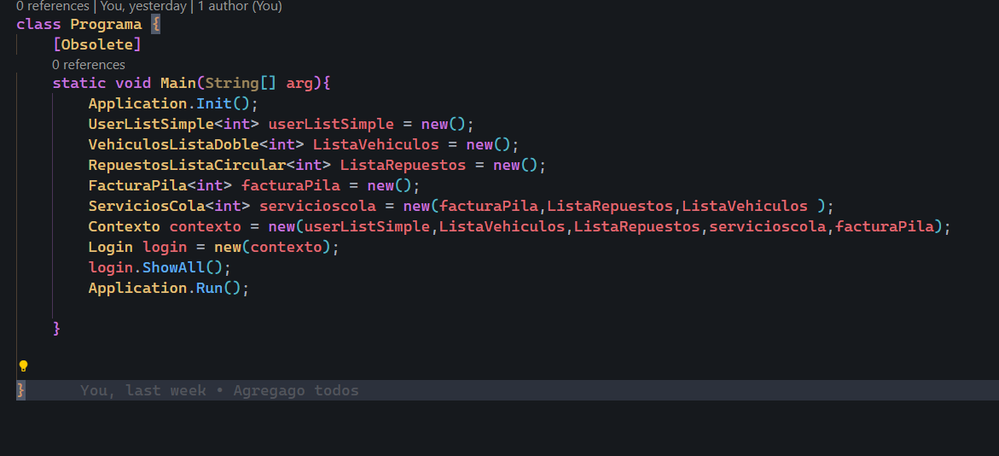

#### JOSE MANUEL ARANA VELASQUEZ
#### UNIVERSIDAD DE SANCARLOS DE GUATEAMALA
#### ESTRUCTURAS DE DATOS 

# 
Manuel Tecnico

### Introduccion
En la programacion actual las bases de programacion son fundamentales para entender el funcionamiento de las tecnologias actuales, este enyaso explora en detalle su manejo para el usuario normal y en este poder encontrar una solucion rapida y mejorara aun utilizando practicas no tan actuales.

## 
Equipo Recomendario

1. Linux Ubunto Version 22
2. 4 Ram
3. Cpu amd athlon 2 en adelante o intel 3 version 1
4. Monitor 800x624
5. Visual Code
6. 64 GB HDD

## 
Estructura

1. Se utilizo Inyeccion de dependencias con un enfoque con un contexto global para pasar datos
2. 
3. Se utilizo Modelos que se instanciaron en la clase contexto y asi poder centralizar la informacion
4. Se utilizo GTK para la interfaz
5. El el main se pasaron los contexto y se fueron pasando entre clases
6. 

## 
Interfaces

1. Se Utilizo GTK para las Pantallas y el contexto para pasar la informacion
2. Todas las clases siguen la misma estructurar, crear los objetos necesarios y construir la nueva pantalla pasandole el contexto 
3. 
4. Tambien se valido con una clase igualmente los errores para mostrar, pero este sin el contexto
5. 

## 
Punteros y Listas

1. Se utilizo unsafe code para el manejo de memoria y punteros
2. se utilizo marshal para el manejo de memoria
3. 
4. y de la misma forma para su liberacion
6. Se uso una clase nodos para hacer los nodos de las listas
7. .
8. Tambien Utilizo el unsafe Modo para que todo pueda ser aceptado correctamente 
9. 
10. tambien para que funcione tiene que ser activado desde las configuraciones al crear el proyecto
11. 
12. En esta parte se indica que le damos permiso de usar el modo seguro

## 
Estructuras de datos

1. En este caso se utilizaron diferentes Estructuras
2. Lista Enlazada
3. Lista Enlazada Doble
4. Lista Circular
5. Pila
6. Cola
7. Matriz dispersa

