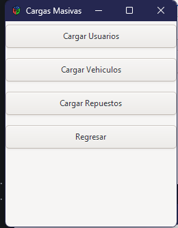
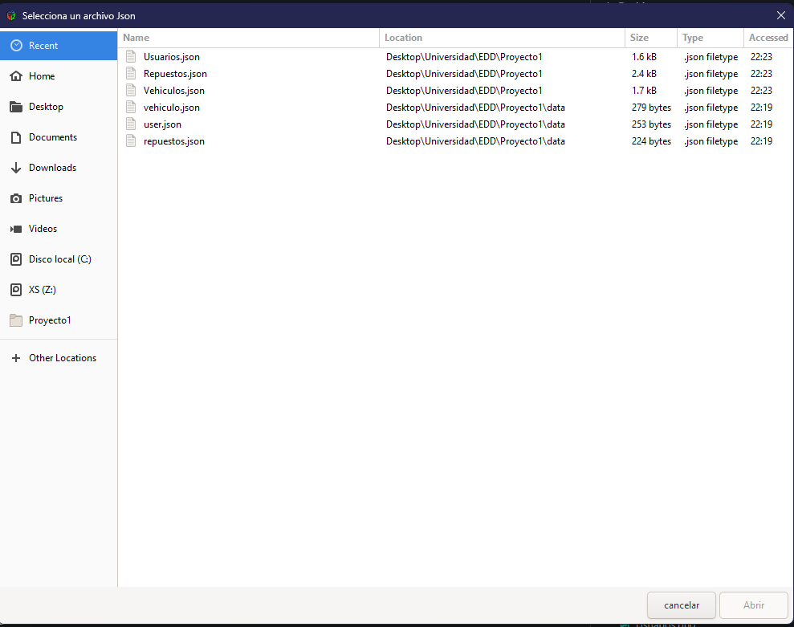
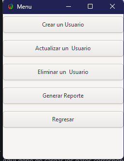
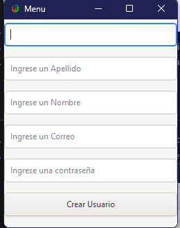
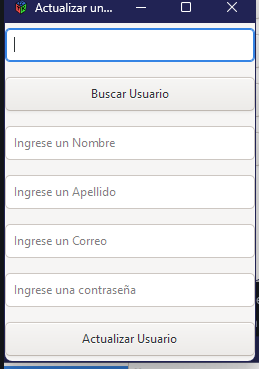
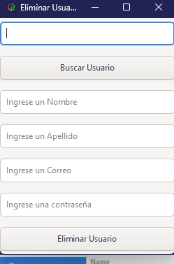
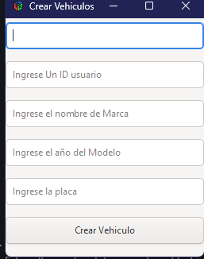
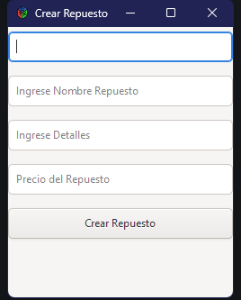
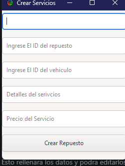
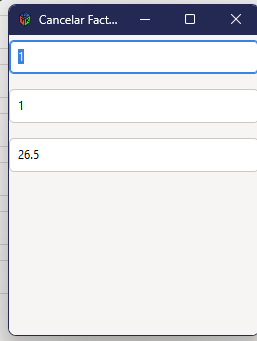

#### JOSE MANUEL ARANA VELASQUEZ
#### UNIVERSIDAD DE SANCARLOS DE GUATEAMALA
#### ESTRUCTURAS DE DATOS 

# 
Manuel de Usuario

### Introduccion
En la programacion actual las bases de programacion son fundamentales para entender el funcionamiento de las tecnologias actuales, este enyaso explora en detalle su manejo para el usuario normal y en este poder encontrar una solucion rapida y mejorara aun utilizando practicas no tan actuales.

## 
Instalaciones

1. Descargar el proyecto
2. Instalar Visual estudio Code
3. Instalar DOTNET para utilizarlo
4. Ejecutar el programa
5. <image src="./Usuario/play.png" alt="Descripción de la imagen">

## 
Incertar Datos

1. Al Iniciar Aparecera el Login para ingresar
2. <image src="./Usuario/login.png" alt="Descripción de la imagen">
3. Aparecera el menu si esta logeado
4. <image src="./Usuario/menu.png" alt="Descripción de la imagen">
5. Primeramente debe de ir a carga masiva y aparecera este menu
6. 
7. Ahora debe de Seleccion los datos que desea cargar en archivo json
8. Al darle seleccion aparecera esta pantalla a continuacion.
9. 
10. Aqui debe de cargar los datos corresponientes.
11. Una ves cargados Todos los datos necesarios estamos listos para poder usar el sistema

## 
Usuarios

1. Una ves de nuevamente en el menu, precionar el boton usuarios
2. Una ves precionado se desplegara un menu con estas opciones.
3. 
4. Se puede crear, Actualizar, Eliminar, Reporte y regresar al menu
5. Crear Desplejara este menu 
6. 
7. Una ves rellenados los datos se creara el usuario media ves no exista el usuario
8. Editar Usuario debe de ingresar un ID que ya exista
9. 
10. Esto rellenara los datos y podra editarlos
11. Eliminar el usuario 
12. 
13. para eliminar un usuario tendra que ingresar un ID valido, con esto se rellanara los campos para validar sea el usuario que quiera eliminar
14. Reportes solo presionar un boton y este generara una imagen con los usuarios que existan
15. 

## 
Vehiculos

1. Para los vehiculos tendra que precionar click desde el menu
2. 
3. Se desplejara un menu donde tendra que ingresar los datos necesarios
4. Con esto se creara el Vehiculo si no existe el ID anteriormente

## 
Repuestos

1. Desde el menu debera de dar al boton crear repuestos
2. 
3. Llenando los datos se creara el repuestos si el ID no existe

## 
Servicios

1. Desde el menu debera de dar al boton Crear Servicios
2. Para poder crear un servicio tiene que tener vehiculos y repuestos existentetes
2. 
3. Llenando los datos se creara el repuestos si el ID no existe

## 
Facturas

1. Esto solo cancelara la facuta de que se acompletado y pagado
2. esto mostrara la informacion necesario
3. 

